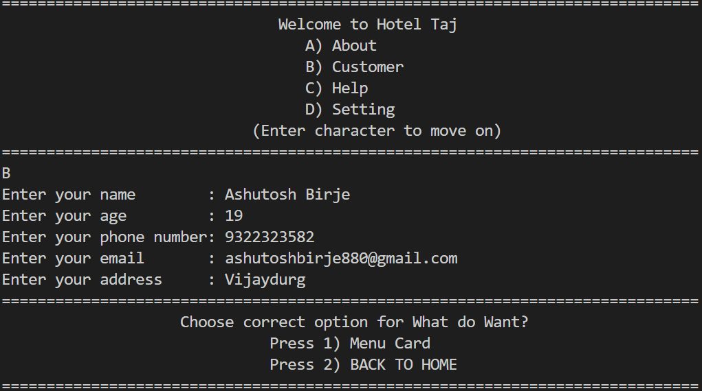

# Hotel Management System

## Overview
The **Hotel Management System** is a software application designed to manage hotel operations efficiently. It includes features such as viewing hotel information, managing customers, booking rooms, and setting software preferences securely with a password.

## Features

### Home Page
- **About**: Contains detailed information about the hotel.
- **Customer**: Allows customers to access different services.
  - **Menu Card**: Displays available food items with prices. Users can select items, and the bill is generated accordingly.
  - **Back to Home**: Navigates back to the home page.
- **Help**: Provides assistance and guidelines on using the software.
- **Settings**: Allows changes in software settings but requires a password for modifications.

## Screenshots

### Home Page View


### About


### Customer View


### Menu Card View


### Order


### Bill


### Customer Data


### Menu Data


### Settings Page


## Installation
```sh
# Clone the repository
git clone <repository_url>

# Navigate to the project folder
cd hotel-management-system

# Run the application
g++ main.cpp -o main.exe
.\main.exe

